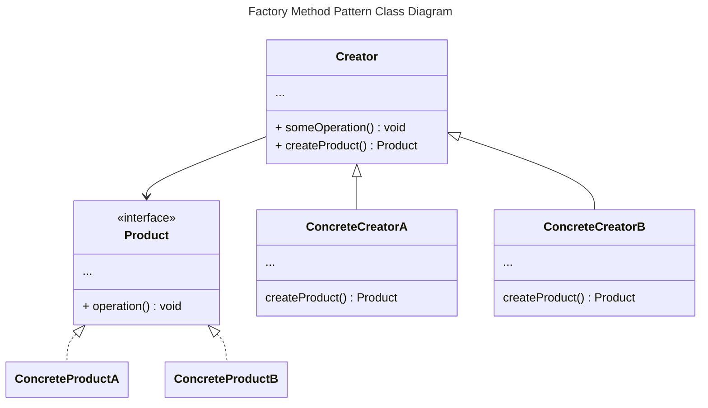

```mermaid
---
title: Factory Method Pattern Class Diagram
description: This diagram illustrates the Factory Method design pattern, showcasing the relationship between the Creator and Product classes.
config:
  class:
    hideEmptyMembersBox: true
    hideEmptyAttributesBox: true
    theme: dark
---

classDiagram
    direction TB
    class Creator {
        ...
        + someOperation() void
        + createProduct() Product
    }

    class Product{
        <<interface>>
        ...
        + operation() void
    }

    class ConcreteProductA
    class ConcreteProductB

    class ConcreteCreatorA {
        ...
        createProduct() Product
    }
    class ConcreteCreatorB {
        ...
        createProduct() Product
    }

    Creator <|-- ConcreteCreatorA
    Creator <|-- ConcreteCreatorB
    Creator --> Product
    Product <|.. ConcreteProductA
    Product <|.. ConcreteProductB

```

